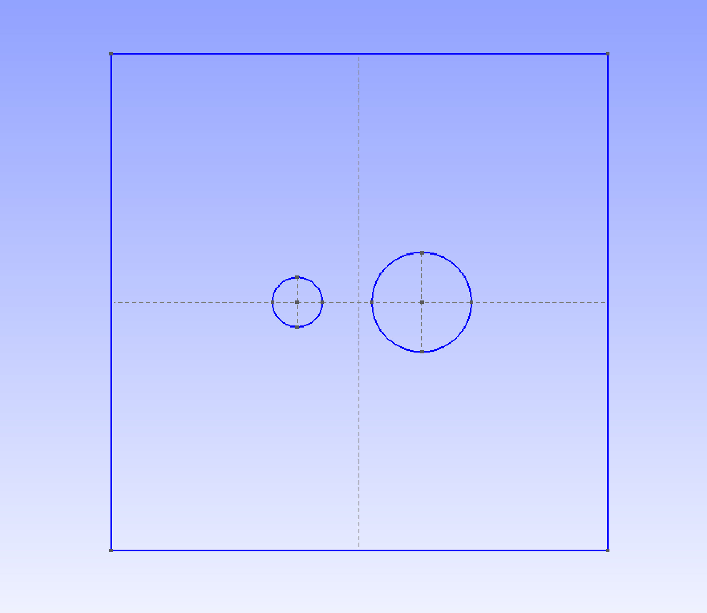
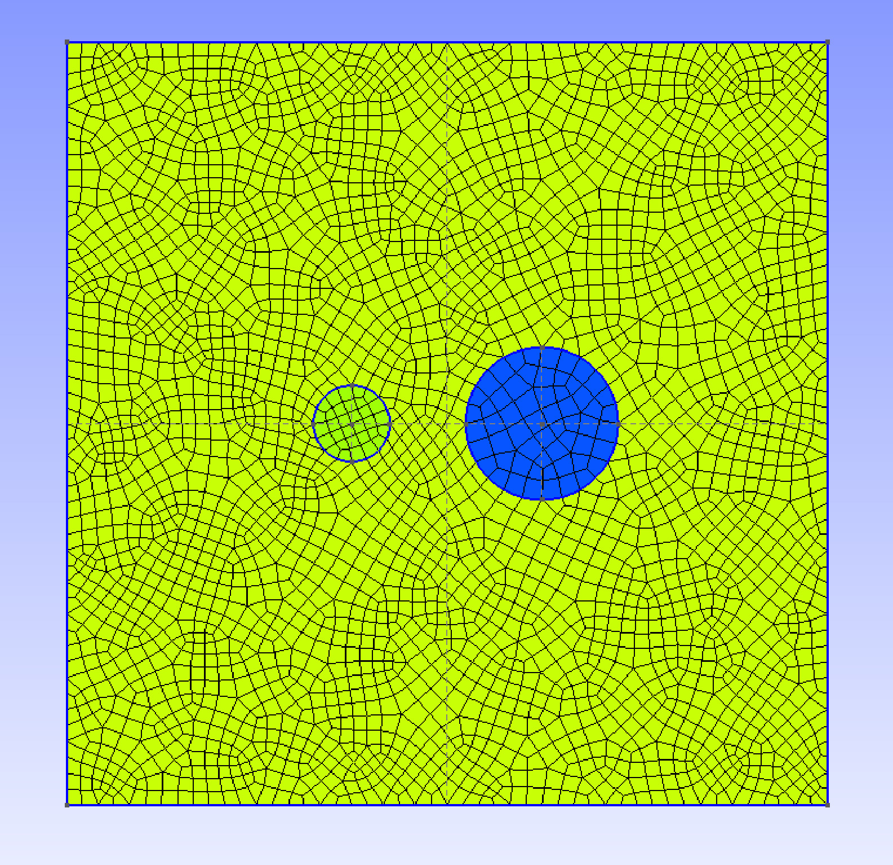
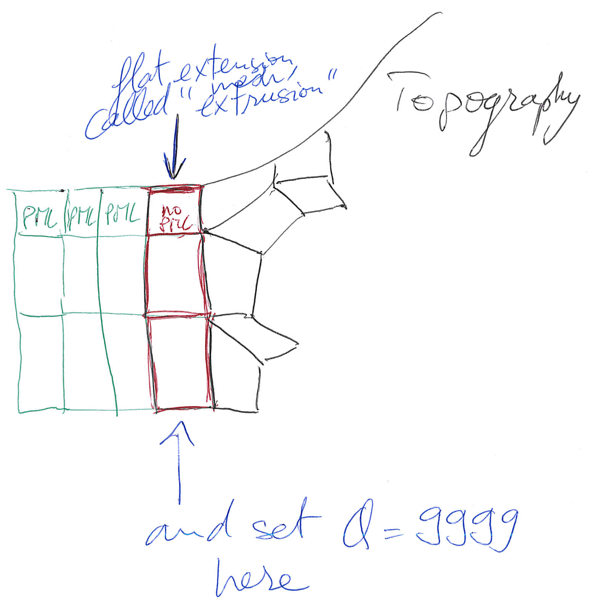

**Table of Contents**

-   [Mesh Generation](#mesh-generation)
    -   [How to use SPECFEM2D](#how-to-use-specfem2d)
    -   [How to use Gmsh to generate an external mesh](#how-to-use-gmsh-to-generate-an-external-mesh)
    -   [How to use Cubit/Trelis to generate an external mesh](#how-to-use-cubittrelis-to-generate-an-external-mesh)
        -   [Note about Cubit/Trelis built-in Python](#note-about-cubittrelis-built-in-python)
    -   [Notes about absorbing PMLs](#notes-about-absorbing-pmls)
    -   [Controlling the quality of an external mesh](#controlling-the-quality-of-an-external-mesh)
    -   [Controlling how the mesh samples the wave field](#controlling-how-the-mesh-samples-the-wave-field)

Mesh Generation
===============

How to use SPECFEM2D
--------------------

Figure: Schematic workflow for a SPECFEM2D simulation. The executable `xmeshfem2D` creates the GLL mesh points and assigns specific model parameters. The executable `xspecfem2D` solves the seismic wave propagation.

To run the mesher, please follow these steps:

-   edit the input file `DATA/Par_file`, which describes the simulation.
    **The default `DATA/Par_file` provided in the root directory of the code contains detailed comments and should be almost self-explanatory (note that some of the older `DATA/Par_file` files provided in the `EXAMPLES` directory work fine but some of the comments they contain may be obsolete or even wrong; thus refer to the default `DATA/Par_file` instead for reliable explanations).**
    If you need more details we do not have a detailed description of all the parameters for the 2D version in this manual but you can find useful information in the manuals of the 3D versions, since many parameters and the general philosophy is similar. They are available at .
    To create acoustic (fluid) regions, just set the S wave speed to zero and the code will see that these elements are fluid and switch to the right equations there automatically, and automatically match them with the solid regions

-   if you are using an external mesher (like GiD or CUBIT / Trelis), you should set `read_external_mesh` to `.true.`:

    mesh\_file  
    is the file describing the mesh : first line is the number of elements, then a list of 4 nodes (quadrilaterals only) forming each elements on each line.

    nodes\_coords\_file  
    is the file containing the coordinates (\(x\) and \(z\)) of each node: number of nodes on the first line, then coordinates x and z on each line.

    materials\_file  
    is the number of the material for every element : an integer ranging from 1 to `nbmodels` on each line.

    free\_surface\_file  
    is the file describing the edges forming the acoustic free surface: number of edges on the first line, then on each line: number of the element, number of nodes forming the free surface (1 for a point, 2 for an edge), the nodes forming the free surface for this element. If you do not want any free surface, just put 0 on the first line; you then get a rigid surface instead.

    axial\_elements\_file  
    is the file describing the axial elements in the case of an axisymmetric simulation. See Section [sec:axisym].

    absorbing\_surface\_file  
    is the file describing the edges forming the absorbing boundaries: number of edges on the first line, then on each line: number of the element, number of nodes forming the absorbing edge (must always be equal to 2), the two nodes forming the absorbing edge for this element, and then the type of absorbing edge: 1 for BOTTOM, 2 for RIGHT, 3 for TOP and 4 for LEFT. Only two nodes per element can be listed, i.e., the second parameter of each line must always be equal to 2. If one of your elements has more than one edge along a given absorbing contour (e.g., if that contour has a corner) then list it twice, putting the first edge on the first line and the second edge on the second line. Do not list the same element with the same absorbing edge twice or more, otherwise absorption will not be correct because the edge integral will be improperly subtracted several times. If one of your elements has a single point along the absorbing contour rather than a full edge, do NOT list it (it would have no weight in the contour integral anyway because it would consist of a single point). If you use 9-node elements, list only the first and last points of the edge and not the intermediate point located around the middle of the edge; the right 9-node curvature will be restored automatically by the code.

    tangential\_detection\_curve\_file  
    contains points describing the envelope, that are used for the `source_normal_to_surface` and `rec_normal_to_surface`. Should be fine grained, and ordered clockwise. Number of points on the first line, then (x,z) coordinates on each line.

-   if you have compiled with MPI, you must specify the number of processes.

Then type

        ./bin/xmeshfem2D

to create the mesh (which will be stored in directory `OUTPUT_FILES/`). `xmeshfem2D` is serial; it will output several files called `Database??????.bin`, one for each process.

Figure: Example of a grid file generated by `xmeshfem2D` and visualized with gnuplot (within gnuplot, type ‘`plot OUTPUT_FILES/gridfile.gnu w l`’).

Regarding mesh point numbering in the files created by the mesher, we use the classical convention of 4-node and 9-node finite elements:

             4 . . . . 7 . . . . 3
             .                   .
             .         eta       .
             .         |         .
             8         9--xi     6
             .                   .
             .                   .
             .                   .
             1 . . . . 5 . . . . 2

the local coordinate system being \(\xi\) and \(\eta\) (`xi` and `eta`). Note that this convention is used to describe the geometry only. In the solver the wave field is then described based on high-order Lagrange interpolants at Gauss-Lobatto-Legendre points, as is classical in spectral-element methods.

How to use Gmsh to generate an external mesh
--------------------------------------------

Gmsh[1] is a 3D finite element grid generator which can be used for the generation of quadrangle and hexahedral meshes. It is therefore a good candidate for generating meshes which can be processed by SPECFEM2D. Only two modules of Gmsh are of interest for the SPECFEM2D users : the geometry and the mesh modules. An example is given in directory `EXAMPLES/Gmsh_example` which illustrates the generation of an external mesh using these two modules. The model that is considered consists of a homogeneous square containing two circles filled with a different material.

The geometry is generated by loading file `SqrCirc.geo` into Gmsh. The end of the `.geo` file contains several lines which are required in order to define the sides of the box and the media. This is done using the following conventions :

> `Physical Line(Top) = {1}; `
>
> `Physical Line(Left) = {2}; `
>
> `Physical Line(Bottom) = {3}; `
>
> `Physical Line(Right) = {4}; `
>
> `Physical Surface(M1) = {10}; `
>
> `Physical Surface(M2) = {11,12}; `

For instance, if you want to fill the two circles with two different materials, you will have to write :

> `Physical Surface(M1) = {10}; `
>
> `Physical Surface(M2) = {11}; `
>
> `Physical Surface(M3) = {12}; `

and, consequently, you will have to define a new medium numbered `3` in the `Par_file`.

Figure: Geometry and mesh of the two circle model generated with Gmsh

Figure: Geometry and mesh of the two circle model generated with Gmsh

Then, a 2D mesh can be created and saved after selecting the appropriate options in Gmsh : `All quads` in `Subdivision algorithm` and `1` or `2` in `Element order` whether you want a 4 or 9 node mesh. This operation will generate a `SqrCirc.msh` file which must be processed to get all the files required by SPECFEM2D when using an external mesh (see previous section). This is done by running a python script called `LibGmsh2Specfem.py`, located in directory `utils/Gmsh`:

        python LibGmsh2Specfem.py SqrCirc -t A -b A -r A -l A

Where the options `-t`, `-b`,` -r` and `-l` represent the different sides of the model (top, bottom, right and left) and can take the values `A` or `F` if the corresponding side is respectively absorbing or free. All boundaries are absorbing by default. The connections of the generated filenames to the filenames indicated in the previous section are :

-   `Mesh_SqrCirc` is the `mesh_file`

-   `Material_SqrCirc` is the `material_file`

-   `Nodes_SqrCirc` is the` ``nodes_coords_file`

-   `Surf_abs_SqrCirc` is the `absorbing_surface_file`

-   `Surf_free_SqrCirc` is the `free_surface_file`

In addition, four files like `free_surface_file` corresponding to the sides of the model are generated.

How to use Cubit/Trelis to generate an external mesh
----------------------------------------------------

Trelis (that was known as Cubit)[2] is a 2D/3D finite element grid generator distributed by Csimsoft which can be used for the generation of quadrangle and hexahedral meshes. Trelis has a convenient interface with Python (module cubit) which allows to create meshes from Python scripts. To get started with Cubit/Trelis we recommend you the step-by-step tutorials available at: <http://www.csimsoft.com/tutorials.jsp> Many powerful graphical tools are available, and very useful, but we will focus here on the command line functionalities and especially the Python interface which is the real force of Cubit/Trelis.

To get started we recommend to the inpatients to open Cubit/Trelis and to click on the following symbol: .
Figure: image
. Then select the files of type Python Files (\*.py) and play the following script:

        utils/cubit2specfem2d/simplest2DexampleWithPmls.py

In the case you want to perform an axisymmetric simulation, we recommend you rather to play:

        utils/cubit2specfem2d/simpleAxisym2dMesh.py

It will create a simple mesh with PMLs. Then re-click on  
Figure: image
 and play:

        utils/cubit2specfem2d/cubit2specfem2d.py

This script will create (in current directory) all the mesh files necessary for a SPECFEM2D simulation. Other commented examples are available. We particularly recommend you to look at the folder
`EXAMPLES/paper_axisymmetry_example` beginning by reading the README available there. Read carefully the comments in these scripts, they are helpful. Another way to use Python together with Cubit/Trelis is to use the script tab. This tab is a real Python terminal that can be used to pass command line python instruction to Cubit/Trelis through the cubit module. In the case of the Script tab is not visible in the command line panel (at the bottom of the screen) do:

        Tools -> Options... -> Layout [-> Cubit Layout] -> Show script tab

This tab will allow you to play the scripts one line after another directly in Cubit/Trelis. With this you should be able to understand how to create meshes and export them under SPECFEM2D format.

### Note about Cubit/Trelis built-in Python

Beware, there are some (annoying) differences between cubit built-in Python and the actual Python langage:

-   `aString + ’anotherString’` can cause problems even after being stored:
    `a = aString`
    `b = a + ’anotherString’`
    Example which is not working:

        pathToMeshDir = pathToSpecfem + 'EXAMPLES/paper_axisymmetry_example/MESH'
        cubit.cmd('cd \"'+pathToMeshDir+'\"')

-   No comments after double dots:
    Example which is not working:

        if True: # Just a dummy comment
            print "Ok!"

    This example works without the comment.

-   `os.makedirs(/aDirectory/)` does not work. It creates a directory named ``
    !!!!! To remove that do: `rm -R ./` AND NEVER `rm -rf ` !!!!!

-   `sys.argv` can not be used

-   No comments ` ` at the beginning of a script

And probably many others! Think about that before getting mad.

Notes about absorbing PMLs
--------------------------

If you use CPML, an additional file listing the CPML elements is needed. Its first line is the total number of CPML elements, and then a list of all the CPML elements, one per line. The format of these lines is: in the first column the CPML element number, and in the second column a flag as follows:

|:---------:|:------------------------------------------------------------------------|
|    Flag   | Meaning                                                                 |
| [0.5ex] 1 | element belongs to a X CPML layer only (either in Xmin or in Xmax)      |
|     2     | element belongs to a Y CPML layer only (either in Ymin or in Ymax)      |
|     3     | element belongs to both a X and a Y CPML layer (i.e., to a CPML corner) |
|   [1ex]   |                                                                         |

[table:CPMLflags]

In order to see how to add PML layers to a mesh / model created with an external mesher such as ‘Gmsh’, see the examples in directory `EXAMPLES/CPML_absorbing_layers`.

If you use PML, the mesh elements that belong to the PML layers can be acoustic or elastic, but not viscoelastic nor poroelastic. Then, when defining your model, you should define these absorbing elements as either acoustic or elastic. If you forget to do that, the code will fix the problem by automatically converting the viscoelastic or poroelastic PML elements to elastic. This means that strictly speaking the PML layer will not be perfectly matched any more, since the physical model will change from viscoelastic or poroelastic to elastic at the entrance of the PML, but in practice this is sufficient and produces only tiny / negligible spurious reflections.

If you use PML and an external mesh (created using an external meshing tool such as Gmsh, CUBIT/TRELIS or similar), try to have elements inside the PML as regular as possible, i.e. ideally non-deformed rectangles obtained by ‘extrusion’ of the edge mesh elements meshing the outer edges of the computational domain without PML; by doing so, the PMLs obtained will be far more stable in time (PML being weakly unstable from a mathematical point of view, very deformed mesh elements inside the PMLs can trigger instabilities much more quickly).

If you have an existing CUBIT (or similar) mesh stored in SPECFEM2D format but do not know how to assign CPML flags to it, we have created a small serial Fortran program that will do that automatically for you. That program is `utils/CPML/convert_external_layers_of_a_given_mesh_to_CPML_layers2D.f90`. When you create the PML layers using that script, you do not need to mark (i.e. assign to physical entities with a specific name) those external layers in the mesher. However you still need to specify the boundary of the mesh as you where doing in the case of absorbing conditions. The script will automatically extract the elements on the PML. It will ask you for a thickness for the PML layers. Suppose that you have created a region with a 1-meter size element, when it will prompt for the PML thickness you can enter 3.1 and it will create a PML 3 element thick. Always input a slightly larger (5-10%) size because the element might be slightly skewed, or if you have not created your PML region via extrusion/webcut in CUBIT/TRELIS.

To stabilize PMLs it also helps to add a transition layer of geometrically-regular non-PML elements, in which attenuation is also turned off (i.e. \(Q_\kappa = Q_\mu = 9999\) in that layer), as in the red layer of Figure [fig:meshextrusion]. Our tools in directory in directory `utils/CPML` will implement that transition layer automatically in future.

To be more precise:

-   If one wants to use PML layers, they should NOT mark the layers according to that python script - the reason is that the `xmeshfem2d` does not recognize those CPML flags. If whoever developed the script adjusts it to solve this problem - this might be a great relief for users; as of now no physical identifiers are needed for those layers.

-   HOWEVER, the “Top”, “Bottom”, “Left”,“ and ”Right" boundaries of the model, need to be re-assigned to outer boundaries of the model - that will be the leftmost boundary of the left -bounding PML , rightmost of the right PML, topmost for the Top PML (if there is one) and the bottom boundary of the bottom layer. Those and only those lines need to have the mentioned identifiers (opposite to the example with the two-holed square with Stacey conditions).

-   There is no need to create Top PML in case one wants it to be reflective; as the fortran script that assigns the flag will ignore the elements that sit within PML-layer thickness distance to the top.

-   The Fortran program `utils/CPML/convert_external_layers_of_a_given_mesh_to_CPML_layers2D.f90` that flags the PML elements does not create additional elements; it simply takes the elements within chosen distance from the boundaries, that sit in the interior of model and marks them as absorbing.

If you use PML and an external velocity and density model (e.g., setting flag “`MODEL`” to `tomography`), you should be careful because mathematically a PML cannot handle heterogeneities along the normal to the PML edge inside the PML layer. This comes from the fact that the damping profile that is defined assumes a constant velocity and density model along the normal direction. Thus, you need to modify your velocity and density model in order for it to be 1D inside the PML, as shown in Figure [fig:modifyexternalvelocitymodeltousePML]. This applies to the bottom layer as well; there you should make sure that your model is 1D and thus constant along the vertical direction.

To summarize, only use a 2D velocity and density model inside the physical region, and in all the PML layers extend it by continuity from its values along the inner PML edge.

Figure: Mesh extrusion for PML (green elements) and a non-PML stabilization layer (red elements).

Figure: How to modify your external 2D velocity and density model in order to use PML. Such a modification is not needed when using Stacey absorbing boundary conditions (but such conditions are significantly less efficient).

Controlling the quality of an external mesh
-------------------------------------------

To examine the quality of the elements in your externally build mesh, type

        ./bin/xcheck_quality_external_mesh

(and answer “3” to the first question asked). This code will tell you which element in the whole mesh has the worst quality (maximum skewness, i.e. maximum deformation of the element angles) and it should be enough to modify this element with the external software package used for the meshing, and to repeat the operation until the maximum skewness of the whole mesh is less or equal to about 0.75 (above is dangerous: from 0.75 to 0.80 could still work, but if there is a single element above 0.80 the mesh should be improved).

The code also shows a histogram of 20 classes of skewness which tells how many element are above the skewness = 0.75, and to which percentage of the total this amounts. To see this histogram, you could type:

        gnuplot plot_mesh_quality_histogram.gnu

This tool is useful to estimate the mesh quality and to see it evolve along the successive corrections.

Controlling how the mesh samples the wave field
-----------------------------------------------

To examine (using Gnuplot) how the mesh samples the wave field, type

        gnuplot plot_points_per_wavelength_histogram.gnu

and also check the following histogram printed on the screen or in the output file:

        histogram of min number of points per S wavelength (P wavelength in
        acoustic regions)
        (too small: poor resolution of calculations - too big = wasting
        memory and CPU time)
        (threshold value is around 4.5 points per wavelength in elastic media
        and 5.5 in acoustic media)

If you see that you have a significant number of mesh elements below the threshold indicated, then your simulations will not be accurate and you should create a denser mesh. Conversely, if you have a significant number of mesh elements above the threshold indicated, the mesh your created is too dense, it will be extremely accurate but the simulations will be slow; using a coarser mesh would be sufficient and would lead to faster simulations.

[1] freely available at the following address : <http://www.geuz.org/gmsh/>

[2] available at <http://www.csimsoft.com/>

-----
> This documentation has been automatically generated by [pandoc](http://www.pandoc.org)
> based on the User manual (LaTeX version) in folder doc/USER_MANUAL/
> (Mar  5, 2021)

