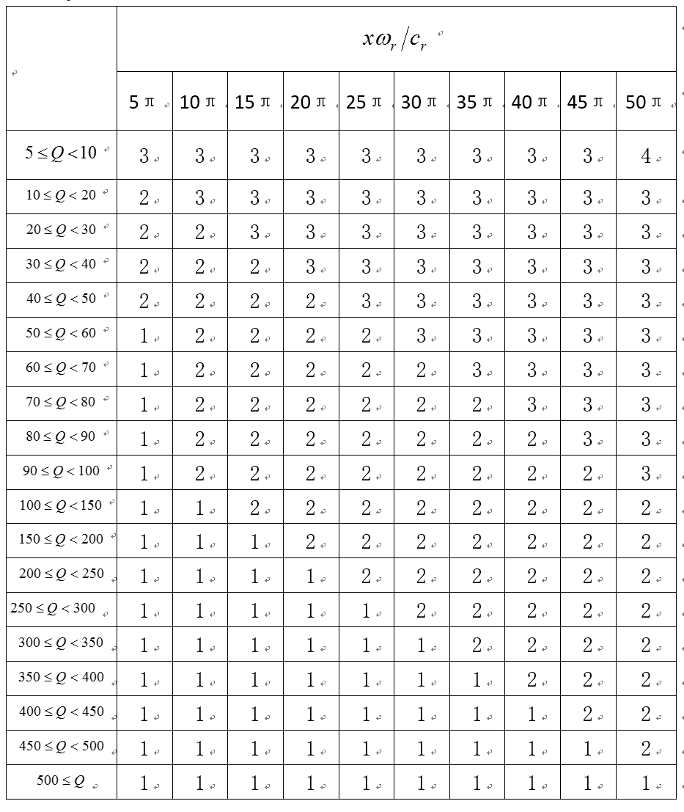

**Table of Contents**

-   [Running the Solver xspecfem2D](#running-the-solver-xspecfem2d)
    -   [Notes about `DATA/Par_file` parameters](#notes-about-datapar_file-parameters)
    -   [Notes about `DATA/SOURCE` parameters](#notes-about-datasource-parameters)
    -   [How to run elastic wave simulations](#how-to-run-elastic-wave-simulations)
    -   [How to run axisymmetric wave simulations](#how-to-run-axisymmetric-wave-simulations)
    -   [How to run anisotropic wave simulations](#how-to-run-anisotropic-wave-simulations)
    -   [How to run poroelastic wave simulations](#how-to-run-poroelastic-wave-simulations)
    -   [Coupled simulations](#coupled-simulations)
    -   [How to choose the time step](#how-to-choose-the-time-step)
    -   [How to set plane waves as initial conditions](#how-to-set-plane-waves-as-initial-conditions)
    -   [Note on the viscoelastic model used](#note-on-the-viscoelastic-model-used)
    -   [Note on viscoelasticity in the 2D plane strain approximation](#note-on-viscoelasticity-in-the-2d-plane-strain-approximation)

Running the Solver xspecfem2D
=============================

To run the solver, type

        bin/xspecfem2D

from within the main working directory (use `mpirun` or equivalent if you compiled with parallel support). This will output the seismograms and snapshots of the wave fronts at different time steps in directory `OUTPUT_FILES/`. To visualize them, type “`gs OUTPUT_FILES/vect*.ps`” to see the Postscript files (in which the wave field is represented with small arrows, fluid/solid matching interfaces with a thick pink line, and absorbing edges with a thick green line) and “`gimp OUTPUT_FILES/image*.gif`” to see the colour snapshot showing a pixelized image of one of the two components of the wave field (or pressure, depending on what you have selected for the output in `DATA/Par_file`).

![Wavefield snapshots of the default example generated by `xspecfem2D` when parameter `output_color_image` is set to `.true.`. To create smaller (subsampled) images you can change double precision parameter `factor_subsample_image = 1.0` to a higher value in file `DATA/Par_file`. This can be useful in the case of very large models. The number of pixels of the image in each direction must be smaller than parameter `NX_NZ_IMAGE_MAX` defined in file `SETUP/constants.h.in`, again to avoid creating huge images in the case of very large models.](figures/image0000300.jpg "fig:") 
Figure: Wavefield snapshots of the default example generated by `xspecfem2D` when parameter `output_color_image` is set to `.true.`. To create smaller (subsampled) images you can change double precision parameter `factor_subsample_image = 1.0` to a higher value in file `DATA/Par_file`. This can be useful in the case of very large models. The number of pixels of the image in each direction must be smaller than parameter `NX_NZ_IMAGE_MAX` defined in file `SETUP/constants.h.in`, again to avoid creating huge images in the case of very large models.
 ![Wavefield snapshots of the default example generated by `xspecfem2D` when parameter `output_color_image` is set to `.true.`. To create smaller (subsampled) images you can change double precision parameter `factor_subsample_image = 1.0` to a higher value in file `DATA/Par_file`. This can be useful in the case of very large models. The number of pixels of the image in each direction must be smaller than parameter `NX_NZ_IMAGE_MAX` defined in file `SETUP/constants.h.in`, again to avoid creating huge images in the case of very large models.](figures/image0000400.jpg "fig:") 
Figure: Wavefield snapshots of the default example generated by `xspecfem2D` when parameter `output_color_image` is set to `.true.`. To create smaller (subsampled) images you can change double precision parameter `factor_subsample_image = 1.0` to a higher value in file `DATA/Par_file`. This can be useful in the case of very large models. The number of pixels of the image in each direction must be smaller than parameter `NX_NZ_IMAGE_MAX` defined in file `SETUP/constants.h.in`, again to avoid creating huge images in the case of very large models.
 ![Wavefield snapshots of the default example generated by `xspecfem2D` when parameter `output_color_image` is set to `.true.`. To create smaller (subsampled) images you can change double precision parameter `factor_subsample_image = 1.0` to a higher value in file `DATA/Par_file`. This can be useful in the case of very large models. The number of pixels of the image in each direction must be smaller than parameter `NX_NZ_IMAGE_MAX` defined in file `SETUP/constants.h.in`, again to avoid creating huge images in the case of very large models.](figures/image0000500.jpg "fig:")

Figure: Wavefield snapshots of the default example generated by `xspecfem2D` when parameter `output_color_image` is set to `.true.`. To create smaller (subsampled) images you can change double precision parameter `factor_subsample_image = 1.0` to a higher value in file `DATA/Par_file`. This can be useful in the case of very large models. The number of pixels of the image in each direction must be smaller than parameter `NX_NZ_IMAGE_MAX` defined in file `SETUP/constants.h.in`, again to avoid creating huge images in the case of very large models.

Please consider these following points, when running the solver:

-   the `DATA/Par_file` given with the code works fine, you can use it without any modification to test the code

-   the seismograms `OUTPUT_FILES/*.sem*` are simple ASCII files with two columns: time in the first column and amplitude in the second, therefore they can be visualized with any tool you like, for instance “`gnuplot`”; if you prefer to output binary seismograms in Seismic Unix format (which is a simple binary array dump) you can use parameter `SU_FORMAT`, in which case all the seismograms will be written to a single file with the extension `*.bin`. Depending on your installation of the Seismic Unix package you can use one of these two commands:

            surange < Uz_file_single.bin
            suoldtonew < Uz_file_single.bin | surange

    to see the header info. Replace `surange` with `suxwigb` to see wiggle plots for the seismograms.

-   if flag `MODEL` in `DATA/Par_file` is set to `default`, the velocity and density model is determined using the `nbmodels` and `nbregions` devices. Otherwise, `nbmodels` values are ignored and the velocity and density model is determined from a user supplied file or subroutine.

-   when compiling with Intel ifort, use “`-assume byterecl`” option to create binary PNM images displaying the wave field

-   there are a few useful scripts and Fortran routines in directory `utils/`.

-   you can find a Fortran code to compute the analytical solution for simple media that we use as a reference in benchmarks in many of our articles at . That code is described in: Berg et al. (1994)

Notes about `DATA/Par_file` parameters
--------------------------------------

The default `DATA/Par_file` provided in the root directory of the code contains detailed comments and should be almost self-explanatory (note that some of the older `DATA/Par_file` files provided in the `EXAMPLES` directory work fine but some of the comments they contain may be obsolete or even wrong; thus refer to the default `DATA/Par_file` instead for reliable explanations).

USE\_TRICK\_FOR\_BETTER\_PRESSURE  
This option can only be used so far if all the receivers record pressure and are in acoustic elements. Use a trick to increase accuracy of pressure seismograms in fluid (acoustic) elements: use the second derivative of the source for the source time function instead of the source itself, and then record `potential_acoustic()` as pressure seismograms instead of `potential_dot_dot_acoustic()`; this is mathematically equivalent, but numerically significantly more accurate because in the explicit Newmark time scheme acceleration is accurate at zeroth order while displacement is accurate at second order, thus in fluid elements `potential_dot_dot_acoustic()` is accurate at zeroth order while `potential_acoustic()` is accurate at second order and thus contains significantly less numerical noise.

READ\_VELOCITIES\_AT\_f0  
shift (i.e. change) velocities read from the input file to take average physical dispersion into account, i.e. if needed change the reference frequency at which these velocities are defined internally in the code: by default, the velocity values that are read at the end of this Par\_file of the code are supposed to be the unrelaxed values, i.e. the velocities at infinite frequency. If you set this flage to .true., the values read are then those for a given frequency called ATTENUATION\_f0\_REFERENCE.

nbmodels  
With `MODEL = default` chosen, a variety of simple velocity and density models can be defined using the `nbmodels` device.

    I:  model_number 1 rho Vp Vs 0 0 QKappa Qmu 0 0 0 0 0 0
    II:  model_number 2 rho c11 c13 c15 c33 c35 c55 c12 c23 c25 0 QKappa Qmu
    III: model_number 3 rhos rhof phi c kxx kxz kzz Ks Kf Kfr etaf mufr Qmu
    IV: model_number -1 0 0 A 0 0 0 0 0 0 0 0 0 0

To make a given region acoustic, use (I) and make `Vs` be zero.

To make a given region isotropic elastic, use (I) and make `Vs` be nonzero. See Section 4.1 for more details.

To make a given region anisotropic, use (II). See Section 4.2 for more details.

To make a given region poroeslatic, use (III). See Section 4.3 for more details.

When viscoelasticity is turned on, the `Vp` and `Vs` values that are read here are the UNRELAXED ones i.e. the values at infinite frequency unless the `READ_VELOCITIES_AT_f0` parameter above is set to true, in which case they are the values at frequency \(f_0\). Please also note that Qmu is always equal to Qs, but Qkappa is in general not equal to Qp. To convert one to the other see `doc/note_on_Qkappa_versus_Qp.pdf` and `utils/attenuation/conversion_from_Qkappa_Qmu_to_Qp_Qs_from_Dahlen_Tromp_959_960.f90`.

nbregions  
With `MODEL = default` chosen, a variety of simple layered model configurations can be specified using the `nbregions` device.

Regarding attenuation (viscoelasticity), in the Par\_file you need to select the number of standard linear solids (N\_SLS) to use to mimic a constant \(Q\) quality factor. Using N\_SLS = 3 is always safe. If (and only if) you know what you are doing, you can try to reduce that in order to reduce the cost of the simulations. Figure [fig:selectNSLS] shows values that you can consider using (again, if and only if you know what you are doing). That table has been created by Zhinan Xie using a comparison between results obtained with a truly-constant \(Q\) and results obtained with its approximation based on N\_SLS standard linear solids. The comparison is performed using the time-frequency misfit and goodness-of-fit criteria proposed by Kristeková, Kristek, and Moczo (2009). The table is drawn for a dimensionless parameter representing the distance of propagation.

Figure: Table showing how you can select a value of N\_SLS smaller than 3, if and only if you know what you are doing.

Notes about `DATA/SOURCE` parameters
------------------------------------

The `SOURCE` file located in the `DATA/` directory should be edited in the following way:

source\_surf  
Set this flag to `.true.` to force the source to be located at the surface of the model, otherwise the sol be placed inside the medium

xs  
source location \(x\) in meters

zs  
source location \(z\) in meters

source\_type  
Set this value equal to `1` for elastic forces or acoustic pressure, set this to `2` for moment tensor sources. For a plane wave including converted and reflected waves at the free surface, P wave = 1, S wave = 2, Rayleigh wave = 3; for a plane wave without converted nor reflected waves at the free surface, i.e. the incident wave only, P wave = 4, S wave = 5. (incident plane waves are turned on by parameter `initialfield` in `DATA/Par_file`).

time\_function\_type  
Choose a source-time function: set this value to `1` to use a Ricker, i.e. the second derivative of a Gaussian, `2` to use the first derivative of a Gaussian, `3` to use a Gaussian, `4` to use a Dirac or `5` to use a Heaviside source-time function. Note that we use the standard definition of a Ricker, for a dominant frequency \(f_0\): \(\mathrm{Ricker}(t) = (1 - 2 a t^2) e^{-a t^2}\), with \(a = \pi^2 f_0^2\), whose Fourier transform is thus: \(\frac{1}{2} \frac{\sqrt{\pi}\omega^2}{a^{3/2}}e^{-\frac{\omega^2}{4 a}}\) This gives the wavelet of Figure [fig:RickerWavelet].

Figure: We use the standard definition of a Ricker (i.e., second derivative of a Gaussian). Image taken from <http://subsurfwiki.org>.

f0  
Set this to the dominant frequency of the source. For point-source simulations using a Heaviside source-time function (`time_function_type = 5`), we recommend setting the source frequency parameter `f0` equal to a high value, which corresponds to simulating a step source-time function, i.e., a moment-rate function that is a delta function.

The `half duration` of a source is obtained by \(1/\mathtt{f0}\). If the code will use a Gaussian source-time function (`time_function_type = 3`) (i.e., a signal with a shape similar to a ‘smoothed triangle’, as explained in Komatitsch and Tromp (2002) and shown in Fig [fig:gauss.vs.triangle]), the source-time function uses a half-width of `half duration`. We prefer to run the solver with `half duration` set to zero and convolve the resulting synthetic seismograms in post-processing after the run, because this way it is easy to use a variety of source-time functions. Komatitsch and Tromp (2002) determined that the noise generated in the simulation by using a step source time function may be safely filtered out afterward based upon a convolution with the desired source time function and/or low-pass filtering. Use the serial code `convolve_source_timefunction.f90` and the script `convolve_source_timefunction.sh` for this purpose, or alternatively use signal-processing software packages such as SAC . Type

        make xconvolve_source_timefunction

to compile the code and then set the parameter `hdur` in `convolve_source_timefunction.sh` to the desired half-duration.

Figure: Comparison of the shape of a triangle and the Gaussian function actually used.

t0  
For single sources, we recommend to set the time shift parameter `t0` equal to \(0.0\). The time shift parameter would simply apply an overall time shift to the synthetics (according to the time shift of the first source), something that can be done in the post-processing. This time shift parameter can be non-zero when using multiple sources.

anglesource  
angle of the source (for a force only); for a plane wave, this is the incidence angle. For moment tensor sources this parameter is unused.

Mxx,Mzz,Mxz  
Moment tensor components (valid only for moment tensor sources, `source_type = 2`). Note that the units for the components of a moment tensor source are different in SPECFEM2D and in SPECFEM3D:

SPECFEM3D:  
in SPECFEM3D the moment tensor components are in dyne\*cm

SPECFEM2D:  
in SPECFEM2D the moment tensor components are in N\*m

To go from strike / dip / slip to CMTSOLUTION moment-tensor format using the classical formulas (of e.g. Aki and Richards (1980) you can use these two small C programs from `SPECFEM3D_GLOBE`:

`./utils/strike_dip_rake_to_CMTSOLUTION.c`

`./utils/CMTSOLUTION_to_AkiRichards.c`

but then it is another story to make a good 2D approximation of that, because in plain-strain P-SV what you get is the equivalent of a line source in the third direction (orthogonal to the plane) rather than a 3D point source For more details on this see e.g. Section 7.3 “Two-dimensional point sources” of the book of Pilant (1979). That book being hard to find, we scanned the related pages in file
`discussion_of_2D_sources_and_approximations_from_Pilant_1979.pdf` in the same directory as this users manual. Another very useful reference addressing that is Helmberger and Vidale (1988) and its recent extension (Li et al. 2014).

factor  
amplification factor

Note, the zero time of the simulation corresponds to the center of the triangle/Gaussian, or the centroid time of the earthquake. The start time of the simulation is \(t=-1.2*\mathtt{half duration} + \mathtt{t0}\) (the factor 1.2 is to make sure the moment rate function is very close to zero when starting the simulation; Heaviside functions use a factor 2.0), the half duration is obtained by \(1/\mathtt{f0}\). If you prefer, you can fix this start time by setting the parameter `USER_T0` in the `constants.h` file to a positive, non-zero value. The simulation in that case would start at a starting time equal to `-USER_T0`.

How to run elastic wave simulations
-----------------------------------

For isotropic elastic materials, there are two options:

P-SV:  
To run a P-SV waves calculation propagating in the \(x\)-\(z\) plane, set `p_sv = .true.` in the `Par_file`.

SH:  
To run a SH (membrane) waves calculation travelling in the \(x\)-\(z\) plane with a \(y\)-component of motion, set `p_sv = .false.`

This feature is only implemented for elastic materials and sensitivity kernels can be calculated (see Tape, Liu, and Tromp (2007) for details on membrane surface waves).

An optional useful Python script called `SEM_save_dir.py` is provided. It allows one to automatically save all the parameters and results of a given simulation.

How to run axisymmetric wave simulations
----------------------------------------

Axisymmetric simulations are possible in SPECFEM2D. For these simulations the 2D domain simulated is physically the meridional 2D shape of an axisymmetric 3D domain. We invite you to read our publication (Bottero et al. 2016) as an introduction. To set the geometry as axisymmetric turn the flag `AXISYM` to `.true.` in the `Par_file`:

       AXISYM                          = .true.

The left border of the model becomes then a symmetry axis. The wavefield calculated is then physically a 3D wavefield obtained by revolution of a 2D wavefield around its left border.
Note about the source:
In axisymmetric geometry the whole model is symmetric with respect to this axis, including the source. Hence if the source is not on the axis it will physically have a circular shape. This is still possible and relevant for some applications as non destructive testing but is most of the time unwanted. This has to be kept in mind. In acoustic medium, as an explosion in a fluid is naturally axisymmetric, the wavefield generated has the correct 3D shape. However, if the source is put in an elastic solid, its 3D radiation pattern will be axisymmetric.
Getting started:
To get started a simple example is available in `EXAMPLES/axisymmetric_case_AXISYM_option`, we encourage you to read the `README` file you will find there. This example contains an example of the use of `AXISYM` option plus a validation using the semi-analytical code OASES (Schmidt (2004)). In this example the domain studied is a water layer lying above a viscoelastic medium. The source is an explosion in the water and the domain is bounded with PMLs.
Note about external meshers:
Using external meshers is possible in axisymmetric geometry. An example is available in
`EXAMPLES/paper_axisymmetry_example` with the mesher Cubit/Trelis (<http://www.csimsoft.com/trelis>). We invite you to check this example and read the previous chapter for more details. The only difference with plane-strain geometry is that SPECFEM2D needs an additional file defining axial elements. The path to this file has to be given in the `Par_file`:

       axial_elements_file             = /path/to/the/axial_elements_file

The axial elements file has the following structure:

            48
             1          2       8456       8457
             2          2       8457       8458
             3          2       8458       8459
             4          2       8459       8460
           623          2        171        204
          1053          2        172       9512
          1054          2        172        173
          1055          2        173        174
          ...

Which is similar to free surface files. Hence the first line contains the number of axial elements, then the other lines contain four columns: element id, number of nodes describing an axial element (always 2), first node id, second node id. Note that the axis elements must include the possible (up and/or down) PMLs elements in contact with the axis. For simplicity we assume that the mesh elements that are in contact with the symmetry axis are in contact with it by a full edge rather than by a single point, i.e. we exclude cases as that of Figure [fig:meshrestrictionontheaxis]. This amounts to imposing that the leftmost layer of elements in the mesh be structured rather than non structured; The rest of the mesh can be non structured.

![[fig:meshrestrictionontheaxis] For simplicity we exclude cases in which the mesh elements that are in contact with the symmetry axis are in contact with it by a single point instead of by a full edge, such as element \(\bar{\Omega}_2\) here. This amounts to imposing that the leftmost layer of elements in the mesh be structured rather than non structured; The rest of the mesh can be non structured.](figures/meshrestrictionontheaxis-eps-converted-to.pdf)

Figure: [fig:meshrestrictionontheaxis] For simplicity we exclude cases in which the mesh elements that are in contact with the symmetry axis are in contact with it by a single point instead of by a full edge, such as element \(\bar{\Omega}_2\) here. This amounts to imposing that the leftmost layer of elements in the mesh be structured rather than non structured; The rest of the mesh can be non structured.

Note about the resolution:
In axisymmetry a different quadrature is used in the axial elements making the number of points per wavelength necessary a slightly bigger (\(\approx 25\%\)) than in plane-strain.
Note about a small remaining bug:
It has to be noted that a small bug is still hiding somewhere in the code. Indeed the output signals generated are correct in the whole domain except in the element containing the source. This small bug has not been solved so far but not prevent to use the code.
Note about a demo code to learn:
A simplistic demo code is available in
`utils/small_SEM_solver_in_Fortran_without_MPI_to_learn`. This simple code is useful to learn how the spectral-element method works in both plane-strain and axisymmetric geometries. Have a look to it if interested. Once in its directory, type `./make_Fortran_2D_axisymmetric.csh` and then `./xspecfem2D` to compile and run. The bug discussed above is not present in this small code.

How to run anisotropic wave simulations
---------------------------------------

Following J. M. Carcione, Kosloff, and Kosloff (1988a), we use the classical reduced Voigt notation to represent symmetric tensors (Helbig 1994; Carcione 2007):

> The constitutive relation of a heterogeneous anisotropic and elastic solid is expressed by the generalized Hooke’s law, which can be written as \[\sigma_{ij} = c_{ijkl} \varepsilon_{kl}, \qquad i, j, k = 1, \dots, 3,\] where \(t\) is the time, \(\mathbf{x}\) is the position vector, \(\sigma_{ij}(\mathbf{x}, t)\) and \(\varepsilon_{ij}(\mathbf{x}, t)\) are the Cartesian components of the stress and strain tensors respectively, and \(c_{ijkl}(\mathbf{x})\) are the components of a fourth-order tensor called the elasticites of the medium. The Einstein convention for repeated indices is used.
>
> To express the stress-strain relation for a transversely isotropic medium we introduce a shortened matrix notation commonly used in the literature. With this convention, pairs of subscripts concerning the elasticities are replaced by a single number according to the following correspondence: \[\begin{aligned}
> (11) \rightarrow 1, &&
> (22) \rightarrow 2, &&
> (33) \rightarrow 3, \\
> (23) = (32) \rightarrow 4, &&
> (31) = (13) \rightarrow 5, &&
> (12) = (21) \rightarrow 6.\end{aligned}\]

Thus in the most general 2D case we have the following convention for the stress-strain relationship:

    ! implement anisotropy in 2D
    sigma_xx = c11*dux_dx + c13*duz_dz + c15*(duz_dx + dux_dz)
    sigma_zz = c13*dux_dx + c33*duz_dz + c35*(duz_dx + dux_dz)
    sigma_xz = c15*dux_dx + c35*duz_dz + c55*(duz_dx + dux_dz)

    ! sigma_yy is not equal to zero in the plane strain formulation
    ! but is used only in post-processing if needed,
    ! to compute pressure for display or seismogram recording purposes
    sigma_yy = c12*dux_dx + c23*duz_dz + c25*(duz_dx + dux_dz)

where the notations are for instance `duz_dx = d(Uz) / dx`.

How to run poroelastic wave simulations
---------------------------------------

Check the following new inputs in `Par_file`:

In section **“\# geometry of model and mesh description”**:  
`TURN_VISCATTENUATION_ON`, `Q0`, and `FREQ0` deal with viscous damping in a poroelastic medium. `Q0` is the quality factor set at the central frequency `FREQ0`. For more details see Morency and Tromp (2008).

In section **“\# time step parameters”**:  
`SIMULATION_TYPE` defines the type of simulation

1.  forward simulation

2.  UNUSED (purposely, for compatibility with the numbering convention used in our 3D codes)

3.  adjoint method and kernels calculation

In section **“\# source parameters”**:  
The code now support multiple sources. `NSOURCE` is the number of sources. Parameters of the sources are displayed in the file `SOURCE`, which must be in the directory `DATA/`. The components of a moment tensor source must be given in N.m, not in dyne.cm as in the `DATA/CMTSOLUTION` source file of the 3D version of the code.

![Example of timing for three sources. The center of the first source triangle is defined to be time zero. Note that this is NOT in general the hypocentral time, or the start time of the source (marked as `tstart`). The time shift parameter `t0` in the `SOURCE` file would be \(t1(=0)\), \(t2\), \(t3\) in this case, and the half-duration parameter, `f0`, would be \(\mathtt{hdur1}=1/\mathtt{f0}_1\), \(\mathtt{hdur2}=1/\mathtt{f0}_2\), \(\mathtt{hdur3}=1/\mathtt{f0}_3\) for the sources 1, 2, 3 respectively.](figures/source_timing.pdf)

Figure: Example of timing for three sources. The center of the first source triangle is defined to be time zero. Note that this is NOT in general the hypocentral time, or the start time of the source (marked as `tstart`). The time shift parameter `t0` in the `SOURCE` file would be \(t1(=0)\), \(t2\), \(t3\) in this case, and the half-duration parameter, `f0`, would be \(\mathtt{hdur1}=1/\mathtt{f0}_1\), \(\mathtt{hdur2}=1/\mathtt{f0}_2\), \(\mathtt{hdur3}=1/\mathtt{f0}_3\) for the sources 1, 2, 3 respectively.

In section **“\# receiver line parameters for seismograms”**:  
`SAVE_FORWARD` determines if the last frame of a forward simulation is saved (`.true.`) or not (`.false`)

In section **“\# define models....”**:  
There are three possible types of models:

1.  (`model_number 1 rho Vp Vs 0 0 QKappa Qmu 0 0 0 0 0 0`) or

2.  (`model_number 2 rho c11 c13 c15 c33 c35 c55 c12 c23 c25 0 0 0`) or

3.  (`model_number 3 rhos rhof phi c kxx kxz kzz Ks Kf Kfr etaf mufr Qmu`).

For isotropic elastic/acoustic material use `I` and set `Vs` to zero to make a given model acoustic, for anisotropic elastic use `II`, and for isotropic poroelastic material use `III`. The mesh can contain acoustic, elastic, and poroelastic models simultaneously.

For anisotropic elastic media the last three parameters, `c12 c23 c25`, are used only when the user asks the code to compute pressure for display or seismogram recording purposes. Thus, if you do not know these parameters for your anisotropic material and/or if you do not plan to display or record pressure you can ignore them and set them to zero. When pressure is used these three parameters are needed because the code needs to compute \(\sigma_{yy}\), which is not equal to zero in the plane strain formulation.

rho\_s  
= solid density

rho\_f  
= fluid density

phi  
= porosity

tort  
= tortuosity

permxx  
= xx component of permeability tensor

permxz  
= xz,zx components of permeability tensor

permzz  
= zz component of permeability tensor

kappa\_s  
= solid bulk modulus

kappa\_f  
= fluid bulk modulus

kappa\_fr  
= frame bulk modulus

eta\_f  
= fluid viscosity

mu\_fr  
= frame shear modulus

Qmu  
= shear quality factor

Note: for the poroelastic case, `mu_s` is irrelevant. For details on the poroelastic theory see Morency and Tromp (2008).

`get_poroelastic_velocities.f90` allows to compute cpI, cpII, and cs function of the source dominant frequency. Notice that for this calculation we use `permxx` and the dominant frequency of the first source, f0(1). Caution if you use several sources with different frequencies and if you consider anistropic permeability.

Coupled simulations
-------------------

The code supports acoustic/elastic, acoustic/poroelastic, elastic/poroelastic, and acoustic, elastic/poroelastic simulations. Elastic/poroelastic coupling supports anisotropy, but not attenuation for the elastic material.

How to choose the time step
---------------------------

Three different explicit conditionally-stable time schemes can be used for elastic, acoustic (fluid) or coupled elastic/acoustic media: the Newmark method, the low-dissipation and low-dispersion fourth-order six-stage Runge-Kutta method (LDDRK4-6) presented in Berland, Bogey, and Bailly (2006), and the classical fourth-order four-stage Runge-Kutta (RK4) method. Currently the last two methods are not implemented for poroelastic media. According to De Basabe and Sen (2010) and Berland, Bogey, and Bailly (2006), with different degrees \(N=NGLLX-1\) of the GLL basis functions the CFL bounds are given in the following tables. Note that by default the SPECFEM solver uses \(NGLLX = 5\) and thus a degree \(N = 4\), which is thus the value you should use in most cases in the following tables. You can directly compare these values with the value given in sentence ‘Max stability for P wave velocity’ in file `output_solver.txt` to see whether you set the correct \(\Delta t\) in `Par_file` or not. For elastic simulation, the CFL value given in `output_solver.txt` does not consider the \(V_p/V_s\) ratio, but the CFL limit slight decreases when \(V_p/V_s\) increases. In viscoelastic simulations the CFL limit does not change compared to the elastic case because we use a rational approximation of a constant quality factor Q, which has no attenuation effect on zero-frequency waves. Additionally, if you use C-PML absorbing layers in your simulations, which are implemented for the Newmark and LDDRK4-6 techniques but not for the classical RK4), the CFL upper limit decreases to approximately 95% of the limit without absorbing layers in the case of Newmark and to 85% in the case of LDDRK4-6.

|:------------:|:-------:|:--------:|:-------:|
| Degree \(N\) | Newmark | LDDRK4-6 |   RK4   |
|   [0.5ex] 1  |  0.709  |   1.349  |  1.003  |
|       2      |  0.577  |   1.098  |  0.816  |
|       3      |  0.593  |   1.129  |  0.839  |
|      *4*     | *0.604* |  *1.150* | *0.854* |
|       5      |  0.608  |   1.157  |  0.860  |
|       6      |  0.608  |   1.157  |  0.860  |
|       7      |  0.608  |   1.157  |  0.860  |
|       8      |  0.607  |   1.155  |  0.858  |
|       9      |  0.607  |   1.155  |  0.858  |
|      10      |  0.607  |   1.155  |  0.858  |
|     [1ex]    |         |          |         |

[table:CFLacoustic]

|:------------:|:-------:|:--------:|:-------:|
| Degree \(N\) | Newmark | LDDRK4-6 |   RK4   |
|   [0.5ex] 1  |  0.816  |   1.553  |  1.154  |
|       2      |  0.666  |   1.268  |  0.942  |
|       3      |  0.684  |   1.302  |  0.967  |
|      *4*     | *0.697* |  *1.327* | *0.986* |
|       5      |  0.700  |   1.332  |  0.990  |
|       6      |  0.700  |   1.332  |  0.990  |
|       7      |  0.700  |   1.332  |  0.990  |
|       8      |  0.699  |   1.330  |  0.989  |
|       9      |  0.698  |   1.328  |  0.987  |
|      10      |  0.698  |   1.328  |  0.987  |
|     [1ex]    |         |          |         |

[table:CFLelastic]

How to set plane waves as initial conditions
--------------------------------------------

To simulate propagation of incoming plane waves in the simulation domain, initial conditions based on analytical formulae of plane waves in homogeneous model need to be set. No additional body or boundary forces are required. To set up this scenario:

`Par_file`:

-   switch on `initialfield = .true. `

-   at this point setting `add_bielak_condition` does not seem to help with absorbing boundaries, therefore, it should be turned off.

`SOURCE`:

-   `zs` has to be the same as the height of the simulation domain defined in `interfacesfile`.

-   `xs` is the \(x\)-coordinate of the intersection of the initial plane wave front with the free surface.

-   `source_type` = 1 for a plane P wave, 2 for a plane SV wave, 3 for a Rayleigh wave.

-   `angleforce` can be negative to indicate a plane wave incident from the right (instead of the left)

Note on the viscoelastic model used
-----------------------------------

The model used is a constant \(Q\), thus with no dependence on frequency (\(Q(f)\) = constant). See e.g. Blanc et al. (2016).

However in practice for technical reasons it is approximated based on the sum of different Generalized Zener body mechanisms and thus the code outputs the band in which the approximation is very good, outside of that range it can be less accurate. The logarithmic center of that frequency band is the `f0` parameter defined (in Hz) in input file `DATA/SOURCE`.

Note on viscoelasticity in the 2D plane strain approximation
------------------------------------------------------------

In 2D plane strain, one spatial dimension is much greater than the others (see for example: [http://www.engineering.ucsb.edu/ hpscicom/projects/stress/introge.pdf](http://www.engineering.ucsb.edu/ hpscicom/projects/stress/introge.pdf)) and thus \(\kappa = \lambda + \mu\) in 2D plane strain (instead of \(\kappa = \lambda + \frac{2}{3} \mu\) in 3D). See for example J. M. Carcione, Kosloff, and Kosloff (1988b) equation (A9), and equation 6 in <http://cherrypit.princeton.edu/papers/paper-99.pdf>.

In 2D axisymmetric I think the 2/3 coefficient is OK, but it would be worth doublechecking.

References
----------

Aki, K., and P. G. Richards. 1980. *Quantitative Seismology, Theory and Methods*. San Francisco, USA: W. H. Freeman.

Berg, P., F. If, P. Nielsen, and O. Skovegaard. 1994. “Analytic Reference Solutions.” In *Modeling the Earth for Oil Exploration, Final Report of the CEC’s GEOSCIENCE I Program 1990-1993*, edited by K. Helbig, 421–27. Pergamon Press, Oxford, United Kingdom.

Berland, J., C. Bogey, and C. Bailly. 2006. “Low-Dissipation and Low-Dispersion Fourth-Order Runge-Kutta Algorithm.” *Computers and Fluids* 35: 1459–63.

Blanc, Émilie, Dimitri Komatitsch, Emmanuel Chaljub, Bruno Lombard, and Zhinan Xie. 2016. “Highly Accurate Stability-Preserving Optimization of the Zener Viscoelastic Model, with Application to Wave Propagation in the Presence of Strong Attenuation.” *Geophys. J. Int.* 205 (1): 427–39. doi:[10.1093/gji/ggw024](http://dx.doi.org/10.1093/gji/ggw024).

Bottero, Alexis, Paul Cristini, Dimitri Komatitsch, and Mark Asch. 2016. “An Axisymmetric Time-Domain Spectral-Element Method for Full-Wave Simulations: Application to Ocean Acoustics.” *J. Acoust. Soc. Am.* 140 (5): 3520–30. doi:[10.1121/1.4965964](http://dx.doi.org/10.1121/1.4965964).

Carcione, J. M., D. Kosloff, and R. Kosloff. 1988a. “Wave Propagation Simulation in an Elastic Anisotropic (Transversely Isotropic) Solid.” *Q. J. Mech. Appl. Math.* 41 (3): 319–45.

———. 1988b. “Wave Propagation Simulation in a Linear Viscoelastic Medium.” *Geophys. J. Int.* 95: 597–611.

Carcione, José M. 2007. *Wave Fields in Real Media: Theory and Numerical Simulation of Wave Propagation in Anisotropic, Anelastic, Porous and Electromagnetic Media*. Second. Amsterdam, The Netherlands: Elsevier Science.

De Basabe, Jonás D., and Mrinal K. Sen. 2010. “Stability of the High-Order Finite Elements for Acoustic or Elastic Wave Propagation with High-Order Time Stepping.” *Geophys. J. Int.* 181 (1): 577–90. doi:[10.1111/j.1365-246X.2010.04536.x](http://dx.doi.org/10.1111/j.1365-246X.2010.04536.x).

Helbig, K. 1994. “Foundations of Anisotropy for Exploration Seismics.” In *Handbook of Geophysical Exploration, Section I: Seismic Exploration*, edited by K. Helbig and S. Treitel. Vol. 22. Oxford, England: Pergamon.

Helmberger, Donald V., and John E. Vidale. 1988. “Modeling Strong Motions Produced by Earthquakes with Two-Dimensional Numerical Codes.” *Bull. Seism. Soc. Am.* 78 (1): 109–21.

Komatitsch, D., and J. Tromp. 2002. “Spectral-Element Simulations of Global Seismic Wave Propagation-I. Validation.” *Geophys. J. Int.* 149 (2): 390–412. doi:[10.1046/j.1365-246X.2002.01653.x](http://dx.doi.org/10.1046/j.1365-246X.2002.01653.x).

Kristeková, Miriam, Jozef Kristek, and Peter Moczo. 2009. “Time-Frequency Misfit and Goodness-of-Fit Criteria for Quantitative Comparison of Time Signals.” *Geophys. J. Int.* 178 (2): 813–25. doi:[10.1111/j.1365-246X.2009.04177.x](http://dx.doi.org/10.1111/j.1365-246X.2009.04177.x).

Li, Dunzhu, Don Helmberger, Robert W. Clayton, and Daoyuan Sun. 2014. “Global Synthetic Seismograms Using a 2-D Finite-Difference Method.” *Geophys. J. Int.* 197 (2): 1166–83. doi:[10.1093/gji/ggu050](http://dx.doi.org/10.1093/gji/ggu050).

Morency, C., and J. Tromp. 2008. “Spectral-Element Simulations of Wave Propagation in Poroelastic Media.” *Geophys. J. Int.* 175: 301–45.

Pilant, Walter L. 1979. *Elastic Waves in the Earth*. Vol. 11 of Developments in Solid Earth Geophysics Series. Amsterdam, The Netherlands: Elsevier Scientific Publishing Company.

Schmidt, H. 2004. *OASES Version 3.1 User Guide and Reference Manual*. Center for Ocean Engineering, Massachusetts Institute of Technology, USA.

Tape, Carl, Qinya Liu, and Jeroen Tromp. 2007. “Finite-Frequency Tomography Using Adjoint Methods - Methodology and Examples Using Membrane Surface Waves.” *Geophys. J. Int.* 168 (3): 1105–29. doi:[10.1111/j.1365-246X.2006.03191.x](http://dx.doi.org/10.1111/j.1365-246X.2006.03191.x).

-----
> This documentation has been automatically generated by [pandoc](http://www.pandoc.org)
> based on the User manual (LaTeX version) in folder doc/USER_MANUAL/
> (Oct  1, 2020)

