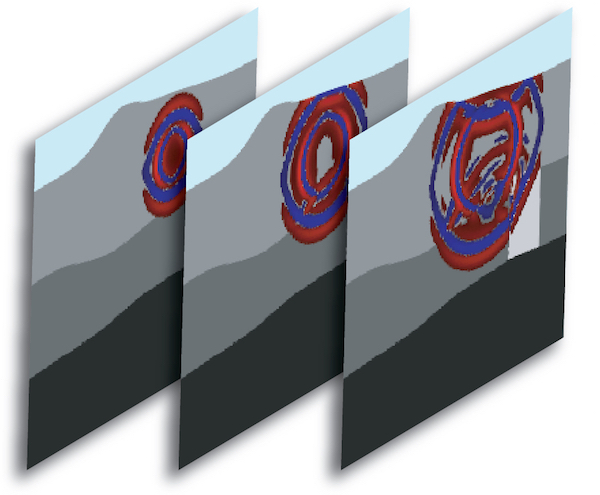

User Manual
===========
> This documentation has been automatically generated by [pandoc](http://www.pandoc.org)
> based on the User manual (LaTeX version) in folder doc/USER_MANUAL/
> (Dec 13, 2022)

>
> For the current PDF version see: [manual_SPECFEM2D.pdf](https://github.com/SPECFEM/specfem2d/raw/devel/doc/USER_MANUAL/manual_SPECFEM2D.pdf)
>

**Table of Contents**

- [01 Introduction](01_introduction)
- [02 Getting Started](02_getting_started)
- [03 Mesh Generation](03_mesh_generation)
- [04 Running The Solver](04_running_the_solver)
- [05 Adjoint Simulations](05_adjoint_simulations)
- [06 Doing Tomography](06_doing_tomography)
- [07 Oil And Gas Industry Simulations](07_oil_and_gas_industry_simulations)
- [08 Informations For Developers](08_informations_for_developers)
- [A Reference Frame](A_reference_frame)
- [B Channel Codes](B_channel_codes)
- [C Troubleshooting](C_troubleshooting)
- [D License](D_license)
- [Authors](authors)
- [Copyright And Version](copyright_and_version)
- [Features](features)
- [Notes And Acknowledgement](notes_and_acknowledgement)
- [Sponsors](sponsors)
